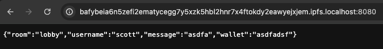
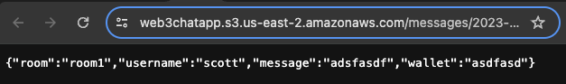

# Web3 Rust Chatapp
This is a simple chat application built with Rust and Rocket framework on web3. 

# Installation
To run this application, you'll need to have Rust and Cargo installed. If you don't have them installed, you can download and install them from https://www.rust-lang.org/learn/get-started.

* The chat-app is for localhost:8000, you can try to use it locally. 
* The chat-app-rust is using the shuttle to deploy the chat-app.

Once you have Rust and Cargo installed, you can clone this repository and run the following command to start the server:
This will start the server on port 8000 by default. You can access the chat app by visiting http://localhost:8000 in your web browser.

# Development Process
The development process for this chat app involved the following steps:

* Setting up a new Rocket project using cargo new
* Adding dependencies to the Cargo.toml file for Rocket, Diesel, and other necessary packages.
* Setting up the database using Diesel migrations and SQLite.
* Creating the necessary models, routes, and controllers for the chat app.
* Implementing WebSocket support using the shuttle service.
* Testing the application and fixing any bugs or errors.
* deploy the application on web3 using wasmd. 
* Add user wallet for the chatapp
* store data on both s3 and IPFS


# Functionality
The chat app allows users to:

* Done:
1. Create a new user name.
2. Join or create chat rooms.
3. Send and receive messages in real time using WebSockets.
4. View a list of online users in each chat room.

* In process:
1. ChatGPT in the chatting room to answer questions. 
2. using IPFS to share file and documents. 

# Packages Used
The following packages were used to build this chat app:
> rocket = {version = "0.5.0-rc.1", features = ["json"]}

> time = "0.3.15"

> shuttle-service = { version = "0.11.0", features = ["web-rocket"] }


# Run 

## start IPFS service 

1.  Download the IPFS 

    ### macOS
    ```
    brew install ipfs
    ```

    ### Linux (# Replace v0.10.0 with the latest version available.)
    ```
    wget https://dist.ipfs.io/go-ipfs/v0.10.0/go-ipfs_v0.10.0_linux-amd64.tar.gz
    tar xvfz go-ipfs_v0.10.0_linux-amd64.tar.gz
    cd go-ipfs
    sudo bash install.sh
    ```
    ### On windows 
    On Windows:
    Download the installer from the [IPFS website](https://ipfs.io/#install) and follow the installation wizard.


2. Initialize IPFS Node
    After installing, you need to initialize your IPFS node. This step creates a new IPFS configuration file and generates a new peer identity for your node.

    Run:
    ```
    ipfs init
    ```

    3. Run IPFS Daemon
    To start your IPFS node, run:
    ```
    ipfs daemon
    ```

## Start the app

```
cd chatapp
cargo run
```
## Get mint

Every time you send a message with your wallet address entered, you can get CTC minted. 


You can check the transaction with https://goerli.etherscan.io/ or directly check the token value change via MetaMask (You need to import the token from the Contract Address First, Please contact us for the defualt contract address). 


## Accessing Files

### From IPFS service
You can access files stored on IPFS via the HTTP gateway:
```
http://localhost:8080/ipfs/<hash>
```
Replace <hash> with the hash returned from the app store command.



### From s3 
login into s3 bucket and open the file 


